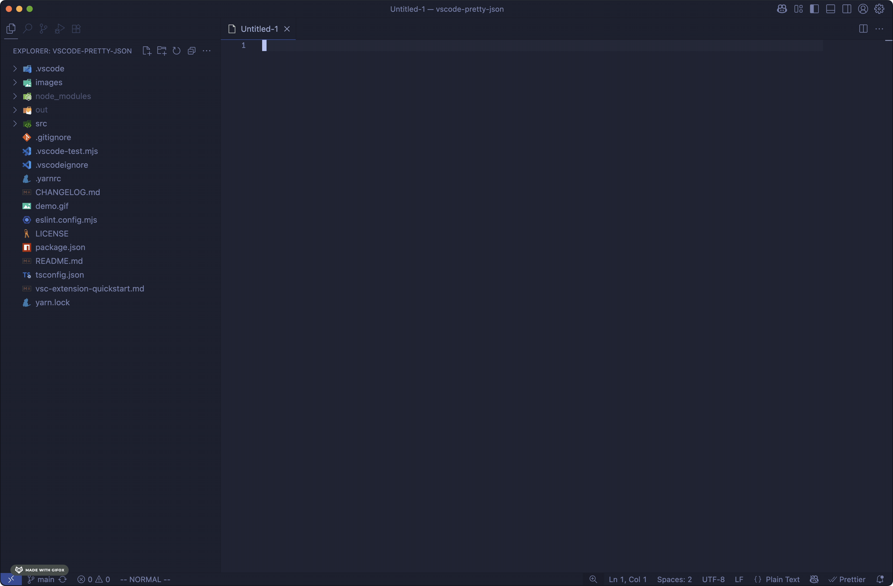

# vscode-pretty-json

Visual Studio Code extension that provides commands to format JSON



## Usage

1. Open a new file and enter some unformatted JSON
1. Open the [command palette](https://code.visualstudio.com/docs/getstarted/userinterface#_command-palette) and run `Pretty JSON: Prettify`
1. Run `Pretty JSON: Uglify` to revert back to the unformatted JSON

## Configuration

By default, this extension does not define any keybindings in order to avoid interfering with existing settings.
However, the commands provided by this extension can be bound to any keybinding.
This can be done by opening the command palette, searching for `Preferences: Open Keyboard Shortcuts (JSON)`, and adding something like the following:

```json
[
  { "key": "ctrl+shift+p", "command": "vscode-pretty-json.prettify" },
  { "key": "ctrl+shift+u", "command": "vscode-pretty-json.uglify" }
]
```
